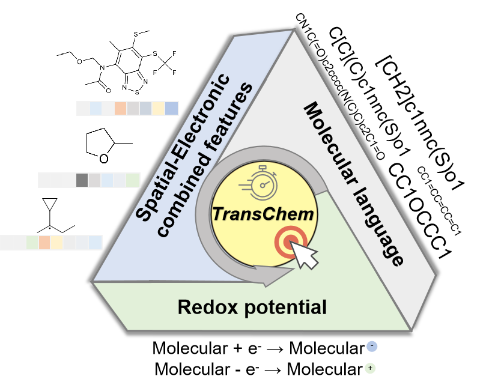
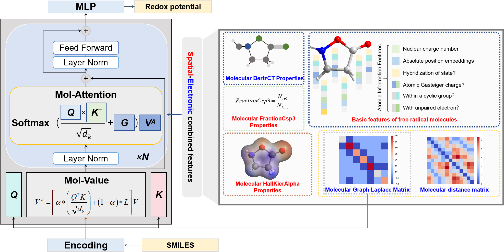

# TransChem

**Paper**: TransChem: Data-based prediction of redox potentials via introducing chemical features into the transformer architecture

  

## Approach

  

## Usage

- [Getting Started](#getting-started)

  - [Prerequisites](#prerequisites)

  - [Prediction](#prediction)

  - [Train TransChem on your own dataset](#train-transchem-on-your-own-dataset)

- [Acknowledgement](#acknowledgement)

- [LICENSE](#license)

### Getting Started

#### Prerequisites

1.  Clone this repo

<!---->

    git clone https://github.com/xianHUJINGJING/TransChem.git
    cd example

1.  Prepare model weight

Download [model_xxx.pt](https://drive) (160M), put it under './model_weight' directory.

1.  Install dependencies.

This code requires Python 3.7, PyTorch, and a few other Python libraries.
We recommend creating conda environment and installing all the dependencies as follows:

    # create conda env
    conda create --name transchem python=3.7
    # activate env
    conda actiavte transchem
    # install pytorch with CUDA 11.0
    conda install pytorch torchvision torchaudio cudatoolkit=11.0 -c pytorch
    # install other python packages
    pip install pickle rdkit sklearn random numpy pandas

The PyTorch version we tested is `1.9.0`.

#### Prediction

    cd example

#### Train TransChem on your own dataset

To train TransChem on your own dataset, please prepare your dataset annotations following the format

Training can be launched by running the following command:

    python train.py

For more configurable options, please checkout our config file [config.py](config.py).

| **Training Args** | **Value** | **Interpretation** |
| ---- |:-------------| :-------------| 
| model | TransChem | # model name |
| save_dir | ./results | # the folder path where the results are saved |
| train_data_path | ./data/ring_train_2w.csv | # file path for train data |
| test_data_path | ./data/ring_test_2w.csv | # file path for test data |
| pretained_path | None | # path to pre-trained model weights file | 
| train_num | all | # number of training samples |
| test_num | all | # number of testing samples | 
| pretrained | False | # whether to use pre-trained weights | 
| **noise** | True | # whether to add noise (or PNCGD) |
| noise_std | 0.2 | # standard deviation of noise |
| gpu | 0 | # GPU index to use |
| epochs | 230 | # number of training epochs |
| es_patience | 50 | # early stopping patience |
| lr | 0.0001 | # learning rate |
| step_size | 10 | # step size for learning rate scheduler |
| gamma | 0.96 | # leaining rate decay factor |
| batch_size | 64 | # batch size for data loaders |
| num_workers | 32 | # number of workers for data loading |
| seed | 42 | # random seed for reproducibility |
 

| **Model Args** | **Value** | **Interpretation** |
| ---- |:-------------| :-------------| 
| d_model | 1024 | # model dimensions of feedforward neural networks |
| N | 8 | # layers  of the model |
| h | 16 | # number of heads of attention module |
| N_dense | 1 | # layers of dense networks |
| trainable_lambda | False | # whether weights of attention and distance matrices etc. are trainable |
| lambda_attention | 0.5 | # the weights of the attention matrix |
| lambda_distance | 0. | # the weights of the distance matrix |
| leaky_relu_slope | 0.1 | # the parameter in LeakyRelu function |
| dense_output_nonlinearity | relu | # the nonlinearity operation in dense layers |
| distance_matrix_kernel | exp | # scaling functions in the distance matrix |
| dropout | 0.1 | # the dropout value |
| aggregation_type | mean | # the ggregation type of the resultes |
 

### LICENSE

The annotation files are under [CC BY-NC-SA 4.0](https://creativecommons.org/licenses/by-nc-sa/4.0/) license, see [./data/LICENSE](data/LICENSE). All the code are under [MIT](https://opensource.org/licenses/MIT) license, see [LICENSE](./LICENSE).

